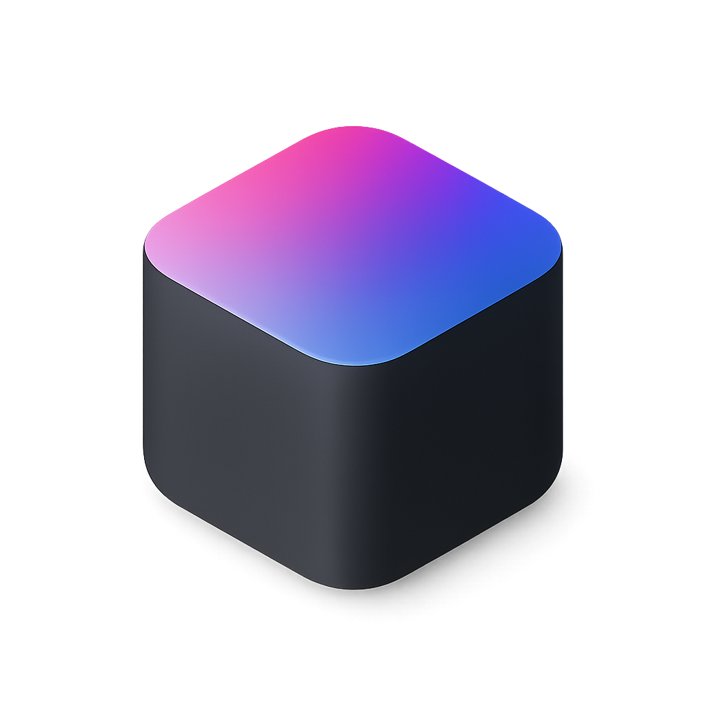
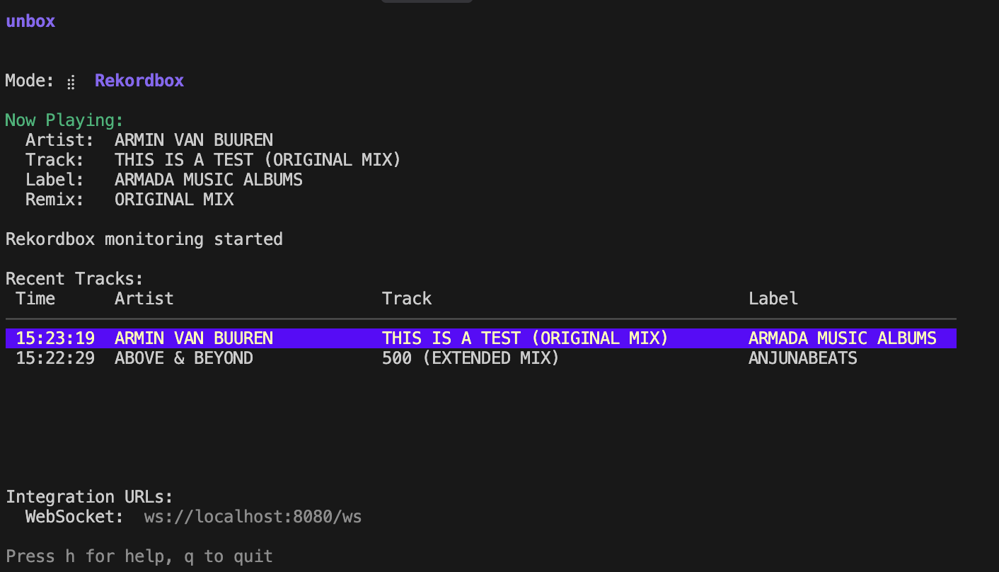
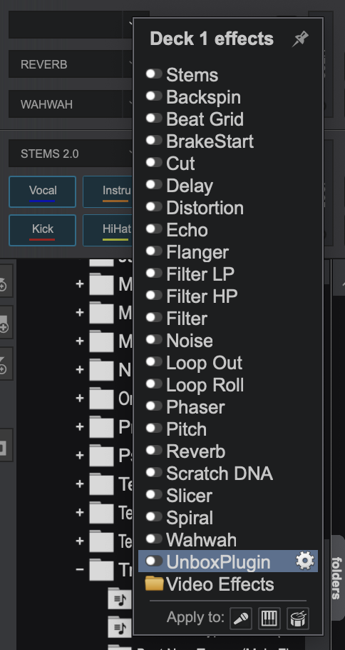
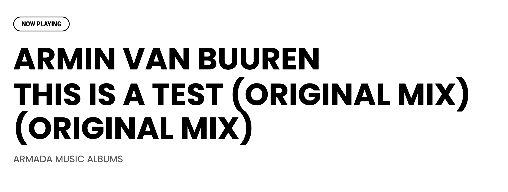
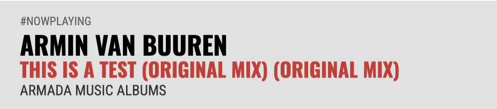
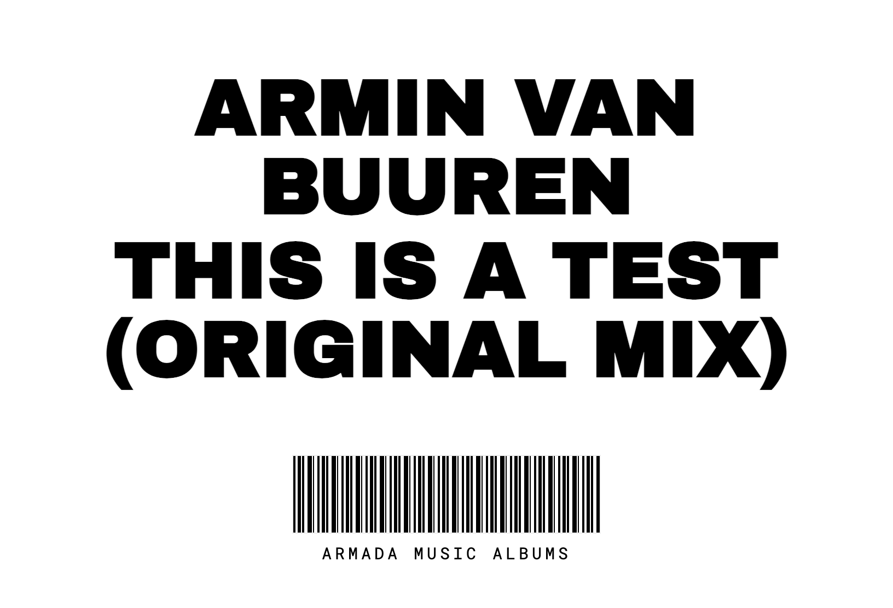
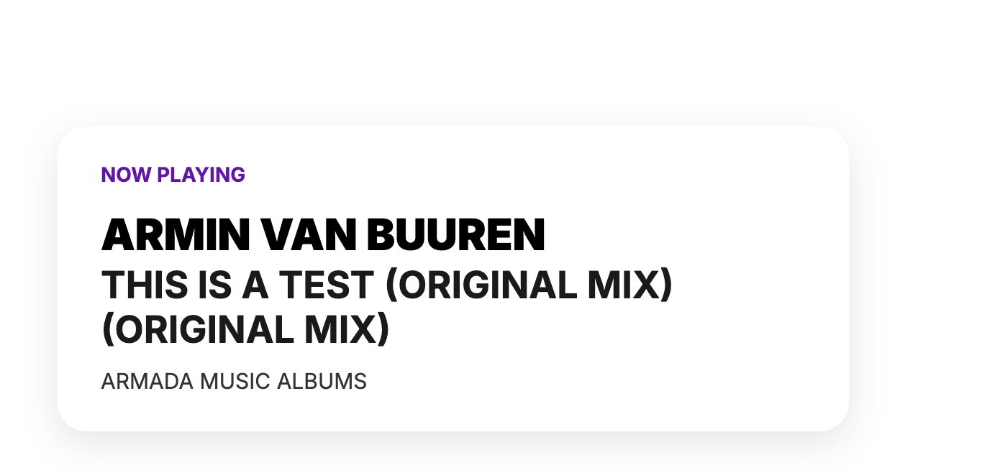
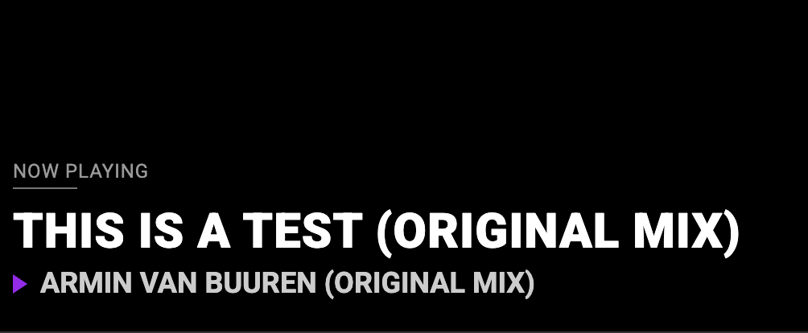

<div align="center">
  <h1 style="border-bottom: none; text-decoration: none; display: inline-block; margin-right: 8px; margin-bottom: 10px; line-height: 1.2;">unbox</h1>

### Display your Rekordbox, Serato, Traktor, VirtualDJ, Mixxx, DJUCED, Denon, and djay Pro tracks to your viewers on Twitch

</div>
<p align="center">
  
</p>

## **Overview**

Unbox is a lightweight Go-based poller that runs in the background, monitoring your DJ software. Unbox aims to be efficient and smaller than many alternatives: while typical Electron-based DJ tracking tools reach 300MB, Unbox is ~20MB. This poller exposes a WebSocket API, allowing you to connect your own custom frontend or integrate with other tools. The TUI (Terminal User Interface) application helps you configure and start this poller. For the easiest integration with your streaming setup, we have a set of [Premium Overlays](#premium-overlays).

## **Our Supporters**

<p align="center">
  <a href="https://www.twitch.tv/djaramistv"> </a>
  <a href="https://www.twitch.tv/reorderdj"> </a>
  <a href="https://www.twitch.tv/hybrid_blak/"> </a>
  <a href="https://www.twitch.tv/djrexy"> </a>
  <a href="https://www.twitch.tv/eddieselnyc"> </a>
</p>

## **Setup**

Unbox is designed to be simple to use while providing the most accurate track metadata software. Download the app, unzip, launch, pick your mode, and copy the URLs into OBS. If you encounter any issues, please create an issue here, and we'll respond ASAP.

1. **Download and install the Unbox lightweight app** (around 20MB). Here's the [Mac version](https://github.com/erikrichardlarson/unbox/releases/download/12/Unbox.zip) and the [Windows version](https://github.com/erikrichardlarson/unbox/releases/download/12/unbox.exe.zip) and the [Linux verion](https://github.com/erikrichardlarson/unbox/releases/download/12/unbox-linux.zip).

2. **Launch the app**. You'll be greeted with a Terminal User Interface (TUI).

3. **Select Your DJ Software Mode**:
    *   Use the **Up/Down arrow keys** (or `k`/`j`) to navigate the list of supported DJ software.
    *   Press **Enter** or **Spacebar** to select your desired mode and start monitoring.
    *   If you select **Serato** and haven't set your Serato User ID, you'll be prompted. You can also press `s` while Serato mode is highlighted (before starting) to set or update your User ID.

4. **For VirtualDJ or Traktor users, we have plugins that allow Unbox to follow the master channel**. This step is performed *after* selecting the respective mode in the TUI and starting the monitoring.

    *   For Traktor, download this [D2 file](https://github.com/erikrichardlarson/unbox/releases/download/12/D2.zip), extract it, and place it in your CSI folder located at `C:\Program Files\Native Instruments\Traktor Pro 3\Resources64\qml\CSI` on Windows or `/Applications/Native Instruments/Traktor Pro 3/Traktor.app/Contents/Resources/qml/CSI` on Mac. Then, open Traktor and select D2 as your controller: `Traktor > Settings > Controller Manager > Select D2 from dropdown`.

    *   For VirtualDJ, download our [Windows plugin](https://github.com/erikrichardlarson/unbox/releases/download/11/UnboxPlugin.zip) or [Mac plugin](https://github.com/erikrichardlarson/unbox/releases/download/11/UnboxPlugin.bundle.zip), extract it, and place it in your `SoundEffect Plugins` folder. This is located at `C:\Users\YOUR_USERNAME\Documents\VirtualDJ\Plugins64\SoundEffect` on Windows or `/Users/<USER>/Library/Application Support/VirtualDJ/PluginsMacArm` on Mac. This plugin will be available in the `Sound Effects` dropdown in VirtualDJ as "WindowsUnboxPlugin" or "MacUnboxPlugin". Select the plugin in the dropdown:

<p align="center">
  
</p>

## **Usage**

- **WebSocket API for Custom Frontends**: For developers wanting to build custom frontends or integrations, the Go poller exposes a WebSocket endpoint at `ws://localhost:8080/ws`. See the "Developer API" section below for more details. This is the primary way to integrate Unbox with your streaming setup if you are not using our [Premium Overlays](#premium-overlays).

- **Viewing Logs**: You can access a log viewer directly within the TUI by pressing the `l` key. This view displays real-time logs from the application, which can be helpful for troubleshooting or understanding its behavior.
    - Press `l` or `Esc` to exit the log view and return to the main screen.
    - While in the log view, you can scroll using the **Up/Down arrow keys**.
    - Press `g` to go to the top of the logs, and `G` to go to the bottom.
    - Press `q` or `Ctrl+C` to quit the application from the log view.

- **Other Keybindings**:
    - Use **Up/Down arrow keys** (or `k`/`j`) to navigate modes before starting.
    - Press **Enter** or **Spacebar** to start/stop monitoring.
    - Press `s` to set your Serato User ID (when Serato mode is highlighted).
    - Press `c` to clear the recent tracks list.
    - Press `h` or `?` to toggle the help display.
    - Press `q` or `Ctrl+C` to quit the application.

## **Premium Overlays**

We are working on a set of premium, customized overlays designed to offer enhanced visual experiences for your streams. If you're interested in early access, have specific design requests, or want to learn more about pricing and availability, please contact us at erikrichardlarson@gmail.com. These overlays are the easiest way to get started with Unbox and help fund the project's continued development.

<p align="center" style="margin-top: 15px;">
  
  
  
  
  
</p>

## **Developer API: WebSocket Integration**

You can connect to the Unbox Go poller via a WebSocket connection to receive real-time track updates.

-   **Endpoint**: `ws://localhost:8080/ws`
-   **Message Format**: JSON

When a new track is detected or track information is updated, the poller will send a JSON message to all connected WebSocket clients. The message will have the following structure:

```json
{
  "artist": "Artist Name",
  "track": "Track Title",
  "label": "Label Name (optional)",
  "remix": "Remixer Name (optional)",
  "artwork": "base64_encoded_image_data (optional)",
  "bpm": "128.0 (optional)",
  "key": "C#m (optional)",
  "genre": "Techno (optional)",
  "album": "Album Name (optional)",
  "comments": "Comments (optional)",
  "date": "Release Date String (optional)"
}
```